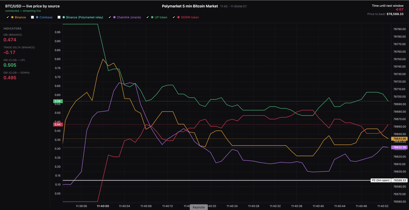

# Polymarket BTC Trading Engine

Real-time infrastructure for trading Polymarket's 5-minute BTC Up/Down markets with multi-exchange feed ingestion, safe order execution with a kill switch, and a live signal-monitoring dashboard. Built with a modular strategy interface, so new signal logic for this market can be dropped in without touching the underlying execution pipeline.

<p align="center">
  
</p>
<p align="center"><sub><i>The live dashboard during an actual 5-minute window with BTC/USD from Binance, Coinbase, and Polymarket's Chainlink oracle relay, plotted against the live UP/DOWN CLOB token prices, with a real-time indicator panel (OBI, trade-flow delta) and a countdown to the next window boundary. The white line is P0, the resolution reference price for this window.</i></sub></p>

## Why this exists

Retail access to real high-frequency trading on traditional markets is mostly theoretical, competing at NYSE or NASDAQ means co-locating servers in their data centers, infrastructure realistically only available to funds and institutions, not individuals.

Polymarket is different: its CLOB matching engine is directly, publicly accessible, and (as covered [below](#deployment-note)) genuine low-latency edge access is available to anyone and no institutional relationship is required. Combined with Bitcoin being one of the most liquid, continuously-traded, data-rich assets that exists, Polymarket's 5-minute BTC Up/Down markets are a rare case where an individual can build and run real low-latency trading infrastructure against a live matching engine.


## What this is

This project simplifies and modularises the trading pipeline for this specific market: proven, working functions for feed ingestion, order execution, and risk control, plus a real-time visualisation layer, built so new strategy logic can be developed and tested on top of it rather than rebuilt from scratch.

**What's solid, reusable infrastructure:**
- Concurrent WebSocket ingestion from Binance, Coinbase, and Polymarket's own RTDS relay (which carries both a Binance passthrough and the actual Chainlink resolution oracle)
- Correct 5-minute window boundary detection and TWAP calculation, shared between the trading scripts and the dashboard via [`twap.py`](trading_engine/twap.py).
- Pure, stateless leading-indicator functions ([`indicators.py`](trading_engine/indicators.py)), order book imbalance and trade-flow delta, usable by both live trading logic and the dashboard's real-time display
- Real order execution against Polymarket's CLOB ([`Order_client.py`](trading_engine/Order_client.py)), with structured lifecycle logging of every signal and trade ([`trade_logger.py`](trading_engine/trade_logger.py))
- Automatic feed reconnection with a silence timeout, not just exception-based retry, but detection of a feed that's gone silently stale (observed once in testing with the Chainlink relay: connection stayed open, stopped producing messages, no error thrown)

## Deployment note

For any of this to be genuinely latency-competitive rather than just functionally correct, the trading logic itself needs to run close to Polymarket's matching engine — not on a home connection. Polymarket's primary servers run in AWS `eu-west-2` (London), with direct co-location available to anyone who completes their KYC/KYB process; `eu-west-1` (Ireland) is the closest region without that verification. Running this system's decision logic anywhere else reintroduces exactly the latency disadvantage this project exists to route around.

## A caveat: paper trading isn't a preview of live results

Every number this system produces in paper/simulated mode assumes trades fill exactly at the price observed at signal time. Real trading doesn't work that way, by the time an order reaches the CLOB and gets matched, the price and available depth have often moved, especially on the fast, thin order books these 5-minute markets have. Slippage is not a rounding error here, it's a first-order effect that can be the difference between a signal that looks profitable on paper and one that isn't live. Any performance numbers from this system should be read with that firmly in mind.

## Future work

- **Rewriting the latency-critical path in Rust or C++.** The current implementation is Python, which is fine for the dashboard and for iterating on strategy logic, but genuine latency-competitive execution eventually needs to shed Python's overhead — this is the planned next iteration for the execution and feed-handling core.
- **Fleshing out backtesting and paper trading properly**, with persistent storage of historical trades and market data, rather than the current ad hoc JSONL logging — a proper store would let new strategies be evaluated against real historical conditions before ever running live.

## Repository structure

```
.
├── trading_engine/
│   ├── Binance_ws.py, Coinbase_ws.py,       # Exchange WebSocket clients — each yields a
│   │   Bitstamp_ws.py, kraken_ws.py          # normalized stream of ticks/trades/depth
│   ├── rtds_ws.py                            # Polymarket's own relay: Binance passthrough
│   │                                         # AND the actual Chainlink resolution oracle
│   ├── clob_ws.py                             # Polymarket's own orderbook/price feed for the
│   │                                         # current UP/DOWN market, auto-rotates every 5 min
│   ├── twap.py                                # Shared TWAP + window-boundary math — the
│   │                                         # canonical implementation, used everywhere
│   ├── indicators.py                          # Pure OBI + trade-flow-delta functions — the
│   │                                         # building blocks for new strategy logic
│   ├── get_market.py                          # Resolves the current 5-min market's slug/token IDs
│   ├── Order_client.py                        # Real order execution wrapper (py_clob_client_v2)
│   ├── Place_order.py                         # Manual single-order test script
│   ├── check_balance.py                       # Quick USDC balance check
│   ├── trade_logger.py                        # Structured JSONL trade lifecycle logging
│   ├── fair_value.py, price_monitor.py         # Live matplotlib cross-exchange comparison tools
│   ├── paper_trading.py, paper_trade_2.py,     # Paper-trading variants of the above
│   │   paper_trade_clob.py
│   └── logs/trades.jsonl                       # Signal/trade event log
├── dashboard/
│   ├── backend.py                              # FastAPI + WebSocket server — reuses the
│   │                                           # trading_engine/ stream functions directly
│   │                                           # rather than reimplementing feed handling
│   └── static/index.html                       # Live chart + indicator panel (vanilla JS)
├── requirements.txt, dashboard/requirements.txt, trading_engine/requirements.txt
└── .env.example                                # Template for required credentials
```


## Getting started

```bash
git clone https://github.com/Stepan-Letsko/polymarket-btc-trading-engine.git
cd polymarket-btc-trading-engine

# set up your own credentials — never commit this file or share its contents
cp trading_engine/.env.example trading_engine/.env
# then fill in trading_engine/.env with your own wallet private key and Polymarket API credentials

pip install -r trading_engine/requirements.txt
pip install -r dashboard/requirements.txt
```

`trading_engine/.env` needs the following keys: never commit this file or share its contents once filled in:

```dotenv
PRIVATE_KEY=""
WALLET_ADDRESS=""
POLY_API_KEY=""
POLY_SECRET=""
POLY_PASSPHRASE=""
```

### Running the dashboard

```bash
cd dashboard
python3.11 -m uvicorn backend:app --host 127.0.0.1 --port 8000
```

Then open **http://127.0.0.1:8000/** in a browser. This runs entirely off live public market data — no credentials or open positions required to watch it.

## Author

**Stepan Letsko** 
